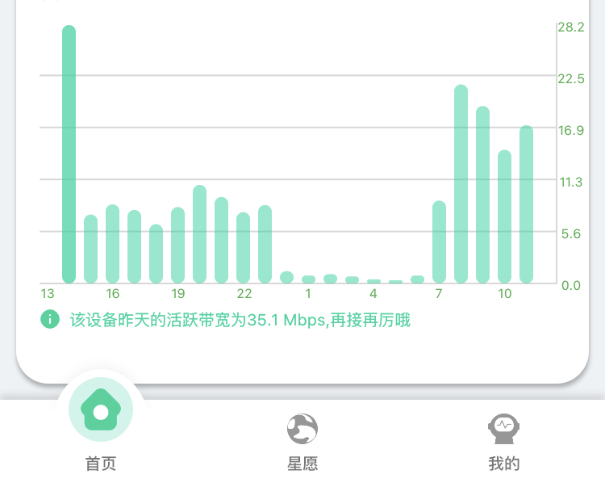
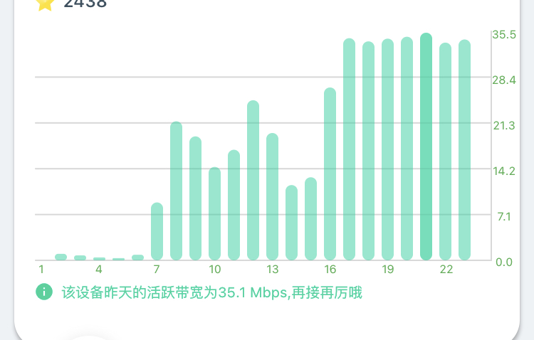
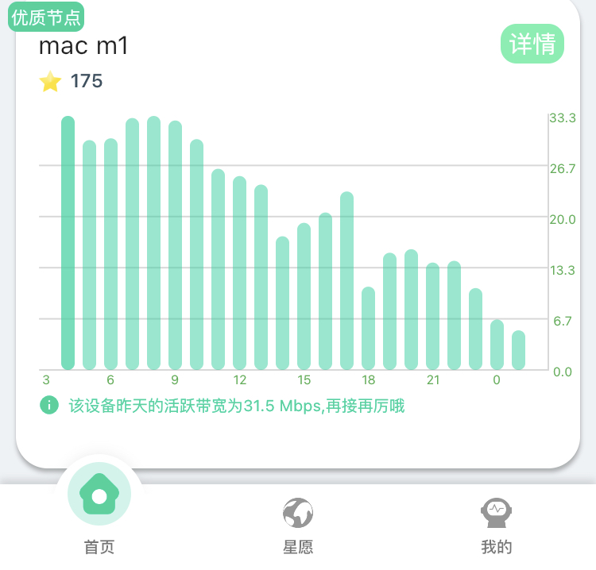

# EK的 甜糖 使用日记

（我是Edna K，不过我乱起了个github名称，就这样把。哈哈。

（看完成功用上甜糖的，别忘了 在甜糖 app里，填写我的邀请码 ：345520，甜糖给你10%的星愿加速，很合适。

这个填写也会给我加速的，所以希望大家觉得有用的，先填写我的邀请码，谢谢啦）

我会持续更新此博客，如果你希望观察一段时间，可以watch或star一下这篇文章。

电报群 https://t.me/shadowrocket_unofficial

## 简介

这个是一家新的边缘计算公司，2020年6月才出现。官网链接：http://m.tiantang.mogencloud.com/

目前没有x86固件，只有路由器插件和安卓应用。docker的话只能用下面教程的办法。

据说30M上传带宽跑满一天有2元收入。请接着往下看，了解我赚了多少。（从2020年12月13日开始）

## 手机安装（第0天，2020.12.13）

我先用我的nova手机试一下。进入上面链接，微信扫码，即可安装。手机有两个app，一个用于监视所有的节点，一个是运行节点的app，如果你要在手机上运行节点上传数据，则都要下。按官方教程操作即可。

之前手机内存不够，其要求储存空间大于32G，我清理了一下。容量够了后，再次连上，就会显示“优质节点”。

根据说明，用手机时，我在光猫开启了Upnp。后来在虚拟机上安装了docker的ttnode，又在光猫开启了DMZ，然而开启后，似乎光猫的UPnP功能就失效了，甜糖显示网络不正常。没招，只好直接用docker。

	
## 各种docker
https://hub.docker.com/search?q=ttnode&type=image

关于docker，我建议使用在hub.docker.com能查到的，更新频繁的，能显示dockerfile的。因为这样公开透明，更新好支持好。

我安装的那个esxi的虚拟机镜像，日后使用，感觉不是特别顺手，如果你不动电脑的话，可以。但是如果你懂，目前我认为这个docker比较好：

https://hub.docker.com/r/ericwang2006/ttnode

就是说，按下面恩山论坛的那个教程进行配置，但是下载docker时，使用上面👆这个docker

## esxi docker 甜糖教程 （直接在电脑上按docker也可以，不会的加群问我）

https://www.right.com.cn/forum/thread-4057352-1-1.html
	
	这里我分区时，无法按回车执行默认分区，需要按p，回车，再输入1，然后再继续操作。
	
	我用的40G的esxi里的虚拟磁盘。
	
	chmod时 +777报错，777行。
		关于chmod
			https://www.runoob.com/linux/linux-comm-chmod.html
			
	
	运行
	./usr/node/ttnode -p /mnts 时，报
	node [8715fc923550c5f76ca3536905691b00,/mnts] exist,error = 11 错误
	
	但是还是产生了uid。不知道行不行。经后来测试，没问题，能正常使用。
	
	产生这个错误的原因是因为 ttnode之前已经启动过一遍（自启动），然后因为这次为了获取uid又启动了一遍，所以它就提示了一下。
	
	虚拟机的用户名密码都是root
	
	看了，里面用的
		qemu-aarch64-static
		
	
	然而我发现配置了此ttnode后，手机上显示nova的网络变成未配置网络，然后网络类型为4，评级变为12.
	
		看网上信息，似乎它俩不冲突。不知为何会这样。
		
		
另外发现这个ttnode里的apk已经换好源了
	vi /etc/apk/repositories 即可查看源。
	
	我觉得可以用这个系统进行轻度作业。
	

### 甜糖定时获取星星（Python+server酱微信推送）
	https://github.com/744287383/AutomationTTnode
	
	好像必须每天登陆app收取星星。
	
	https://www.right.com.cn/FORUM/thread-4034075-1-1.html
	
	每天凌晨2点才计算生成了多少星星。
	
### Openwrt也有自动收集插件，luci-app-ttnode, 链接在： https://github.com/jerrykuku/luci-app-ttnode
	
	
	
我是从【第一天】（2020.12.14，周一）的凌晨试的，从凌晨到早8点基本不会产生缓存；从8点到12点产生了1G缓存；
我家的宽带是联通200Mbps，上传30Mbps，具有动态公网ipv6地址。
	
	晚六点查看依然是1G，但是整机功率变为了60w（原来50w）。
	晚七点查看变为2Ｇ

	使用esxi的网页端查看，发现果然，ttnode的cpu占用率为24%
	
	网络使用情况，果然，上传带宽开始全部被占用，为40Mbps
	
	esxi的performance查看只能查看最近一个小时的情况
	
	所以我准备时机成熟时，关闭一下ttnode，然后多给他分配一个cpu核心，看看耗电情况会不会改善。

我个人还有个疑问。这个dmz是不是不一定非要启动？因为我有ipv6。但是为了保险我还是启用了。

## 我看了，它主要是一个32位的程序，叫ttnode。
	代码在 https://github.com/898811295/TTarm32
	
	它主要是通过 cron，每分钟运行一次 crash_monitor.sh
		然后如果观察到ttnode未运行，则运行ttnode
		
		TT272440.sh 和 272440.sh 都是用于安装的脚本，安装后会自动被删掉。
		
	它使用挂载到 /mnt/ttnode 的磁盘。里面存储其上传所需的缓存。
	
	它在第一次运行docker时，使用了 --restart=always，使得该容器可以在docker重启后自动启动。
	
		而docker的服务已经配置好了，运行service docker status就可以看到。
	
		所以开启后，docker先自动运行，然后内部的arm容器自动运行，然后cron自动运行，最后运行ttnode。
		
	这里有拉取docker的教程
		http://cdn.ssr0.cn:8000/archives/384.html
		
		就是先拉qemu的，后拉ttnode的。很明显，ttnode是建立在qemu层之上的。
		
	
		https://www.right.com.cn/forum/forum.php?mod=viewthread&tid=4052765
		
	至于甜糖的docker容器是如何制作的，没有教程。
	
	
	
	
## 提现规则
	每周三中午12点前提现的金额，周四统一到账，扣6%增值税
	
	每日签到获得1-2星愿
	
	星愿七天不采集，每天衰减10%
	
	App里有个活动，我领了个30天的“电费卡”，说是每天50星愿保底收益。
	
	100颗星星等于1RMB，满10RMB可提现
	
	
### 这个是用的docker+ qemu的方式。
	我担心qemu效率太低，搜了一下，发现kqemu这个东西

### 关于qemu 和docker

	https://blog.csdn.net/ccgshigao/article/details/109631585
	
# 日记第一部分
	
**【第二天】** （12.15，周二）两点后更新了，获得92星；缓存依然是2Ｇ. 第二天早八点半，缓存依然是2G，而且已经可以看出，流量有很明显的晚高峰特征。除了晚高峰以外，几乎不上传流量，cpu也不占用。

我重启了一下ttnode，发现uid更换了，iphone的app上会显示发现新设备，然后重新绑定。
	不过缓存和数据都还在。
	
	而旧的节点就会显示“获取信息中”，看来旧的id已经不可用，可以删掉。
	

**【第二天】** 晚5点四十查看，发现缓存变为3G

给ttnode多分配一个核心后，总占用率变为12.5%，也就是说实际上效率没有变化。

**【第三天】** 早七点四十查看，获得星愿119，缓存变为4Ｇ。
第三天（2020.12.16）下午三点，缓存变为5Ｇ，晚10点，缓存变8G，晚11点，缓存变9G，且节点评级变为1（原来节点评级一直为3）.

后来发现ttnode里的 crontab 出问题了，crontab -e 命令无法修改，就是说无论里面做了什么改动都不会生效。不过修改 /var/spool/cron/crontabs/root 文件是可以的，用crontab -l 能成功看到变化。

	我个人怀疑可能是我把vi 的软连接改成了 vim的缘故
	
	试了，果然，把vi重新指向busybox, crontab -e就可以正常保存了。
	
	总之alpine还是太奇葩。
	
后来猛然想起，开了DMZ后外网就可以接入我的ttnode虚拟机（密码太简单），很危险。所以就将ttnode的密码修改,改为较强的密码

**【第四天】** 中午我断线1小时，用来测试宽带多拨，失败。再开机，发现每次ttnode上网被识别需要15分钟时间。且过两小时发现，显示的在线率变为92%，节点评级变为5。缓存变10Ｇ

**【第四天】** 晚，我用另一个手机号注册了甜糖，绑定了另一个人的手机号和微信号。同时填入了我主号的邀请码，应该能给我主号增加收益吧。

	后来才反应过来，它是获得所推广的好友的星愿收益的5%，所以自己还真没法刷，除非拿我手机登我妈的甜糖天天挂着。
	所以我希望通过写教程的方式，能让大家也用上甜糖。
	
这个甜糖之所以好玩，就在于它既可以用路由器，又可以用docker，还可以用手机。比一般的入门门槛低。

**【第五天】** 早，收集**188星愿（第四天131，第三天119，第二天92，第一天0）**。第五天，离上次关机24小时后，果然在线率变为100%，节点评级也回归1
第五天晚，缓存变为11G。

**【第六天】** （周六）早，收集**226**星愿，终于超过2元了。第六天上午十点，缓存变为12G。下午一点，缓存变13Ｇ。下午5点，变为14G。
可以看出，最快时，大概4小时能增加1G的缓存

# 星愿减少事件

**【第七天】** （周日）早四点，收集**176**星愿（不知为何，我一直开着的）, 缓存16Ｇ；晚上变为19Ｇ。

**【第八天】** (12.21，周一)早八点，收集星愿**129**，缓存25Ｇ，节点评级从1变成2。开始不香了。真是奇怪。我明明一直开机的。

我现在开始怀疑，是不是我添加了一个循环脚本导致的。正好在第六天，我开始添加了一个循环脚本，用于其他目的，也许它占用的cpu和磁盘使用率太高了。我现在把它关一下，再做观察

**【第九天】** 早（周二），收集星愿**64**，缓存27G，节点评级变为1，凉了。已证明不是其他问题，就是甜糖有鬼。交流群里也纷纷表示收益缩水。难道说甜糖杀熟？昨天前天还能跑满带宽的二分之一，今天只有三分之一。就算工作日缩水也说不通，因为我从周日早上开始就缩水。

另外也证明了，如果上传流量低，则下载缓存的速度也会跟着减慢。

另外，openwrt的自动采集星愿插件似乎有问题，无法保存设置，点击保存设置没反应，而刷新页面后之前的设置又被重置。今天我的星愿是自己采集的，它没能采集成功。

上午，我实在忍不住，决定做一些变化。将ttnode重启。重启后惊奇发现，uid依然没改，缓存竟然减少到24G，目前内存占用率才13%（内存2G，平时占用一般50%以上）。观察观察，会不会改善状况。目前我的排名也在下滑，最厉害时进入前1000，现在才2000多名，说明可能我这里也有问题，或者说更多的大鳄挤进了排名，抢走了我们的流量。

经观察，上述重启ttnode的操作没有改变任何现状，cpu使用率依然低迷，证明上传也很低迷。

**第九天晚八点半，无意中发现，自己家的电脑虽然具有ipv6地址，但是连不上ipv6网络！难道说这就是星愿减少的原因？**

**我立即重启了光猫，果然，重启后，光猫重新分配了新的ipv6地址，能连上ipv6了！这回再看一看后天得到的星愿吧。（明天是指不上了，因为算的是今天的，而今天已经到了晚上了我才反应过来。——）**

目前感觉确实是ipv6的问题。我未重启光猫前，ttnode的cpu使用率一直为0，但是重启光猫后，ttnode虽然获得了新的ipv6，cpu使用率还是0. 再重启ttnode后，cpu使用率恢复高上传时的使用率！

	这同时也证明，我家只有ipv6时有公网的，ipv4可能大内网都算不上，所以就算开了DMZ也没个屁用（或者只有“一个屁”的作用）。下回我有机会关掉DMZ试试，按我的逻辑应该没有任何区别。

**【第十天】** 凌晨2点，蹲点收**102**星愿。缓存26G，内存占用13%。个人认为，可能它所说的缓存是指已经存入硬盘的大小加上内存中的缓存的大小。所以才导致了上次重启后缓存大小反而减小的情况。而且之前内存占用一直50%多现在却保持在低位，确实有点意思。早9点，观察甜糖里的网速条形图，可以看到网速巨大地提升，可见ipv6有多重要。

不过仍然觉得不保险，正在学习一些方法，看看能不能抓包啥的看看是不是真的是在使用ipv6.

然而使用netstat -nape 发现，都是ipv4的连接，也不知道是netstat只能显示ipv4还是怎样。

*其实还有一种可能，就是光猫的DMZ之前也出现问题了，然后重启光猫后DMZ恢复了所以甜糖又好了，也不知道到底咋回事。光猫的DMZ是只针对ipv4的。*

*或者还有一种可能，就是光猫把ipv4的数据通过ipv6发送了？个人完全瞎猜*

# Netstat 探索

使用netstat -nape 或者 -np, 可以发现，甜糖使用ipv4的31121端口，通过tcp协议，向各个未知的ip地址的随机端口发送大量数据。

不用n参数时，还意外获取到了 adsl-pool.jlccptt.net.cn这个域名。

个人认为，netstat显示的不全. 毕竟我是用的这个esxi的虚拟机是个alpine的，用的busybox，而busybox所实现的netstat功能并不完整。

然而用apk add 了 iproute2后调用ss命令，还是只显示了这些ipv4点连接。

还有一个问题，会不会创建docker的人本身就只开启了ipv4？我不是很懂，但是只要不是掌控在自己手里，就可能是问题的来源。

另外我还不满的一点就是，上面教程提供的虚拟机为alpine, 但是里面docker又是一个ubuntu。（后来发现，是因为由于alpine的libc库有问题不能跑ttnode。但是那也可以用debian啊，ubuntu尺寸多大）

我在docker内部试验了，docker内部是能ping6通国际ipv6地址的。看来基本已经确认，ttnode使用的是ipv4. **那如此说来我光猫的问题出在DMZ故障，反正光猫垃圾就是**

其实到底是ipv6问题还是dmz问题非常好验证，只要关闭dmz，看看流量是不是还是那么大就行了。如果赚的星愿一样多，那肯定就是ipv6. 不过既然现在已经好了，不妨再等到下一次出问题再做尝试。

**不过最蹊跷的就是，如果真的是DMZ出问题了，那我的节点评级一定会变的很差，而当时我依然被判断为优质节点，节点评级在1～3之间徘徊。所以我依然保留【ttnode使用ipv6】的想法。**

# 日记第二部分：流量减少事件

**【第11天】** 早八点，收集260星愿。我昨天一整天，除了凌晨1-3点没有量以外，都是满速运行，直到昨天晚上我关机出问题。但是还是出了个问题。昨晚我关闭了一下软路由，安装一下硬件啥的，但是发现自从重新开机后，流量迅速下滑，cpu使用率也一直是0。 现在似乎明了了一点，就是凡是直接在esxi中poweroff关机的，都会导致ttnode在下次开机时没流量。因此下一次我关机试一下先用shutdown命令。

此次没流量一直从昨晚大概我重新开机开始，到今晨8点收星愿止。因此可以说应该是关机导致的。

同样，此次，我先重启光猫，待光猫稳定后，再重新开机后，ttnode并没有自动恢复cpu使用率。我再次重启了ttnode虚拟机后依然不行。成功的做法是重启一下docker服务。不过这有待多次测试以验证。

这次与上次不同的是，这一次ipv6并未出现故障，也就是说，重启前，内网是可以ping6通国际ipv6地址的。因此这进一步证明很可能问题不是出在ipv6上。

**【第12天】** （12月25日）早八点，收集**190**星愿，在意料之中，毕竟昨天凌晨0点到早上八点一直没流量。缓存依然为26G，缓存都好几天没变了，比较奇怪。（我存储大小总共为40G，但是因为某种原因显示为39G，难道说甜糖喜欢只占用三分之二的空间？）。

另外今天甜糖出活动，双旦期间天天可以抽奖，双旦当天还可以在微信抽加速卡。

目前凌晨1-4点、下午2-4点，这两个时段流量会下降，其余时刻我都是在满速运行。目前的总结就是不要随便关机ttnode，如果关机了，再开机，有几率ttnode流量大减，结果就是像我之前的操作一番才能恢复。目前决定放置ttnode一周不动，观察观察。

另外，**最近这几次重启，uid都没有变化**。所以我认为，可能缓存达到很高（比如10G以上）后，uid就不会随意改变了。不过这只是目前的结论，有待进一步考察。

**第12天下午5点，缓存变27G，发现还是没流量（一上午都很正常，到了12点就略有下滑，到1-4点按规律流量下跌，但是5点流量未恢复）。感觉不符合规律，忍不了，又重启了一遍，这次我没重启光猫。发现重启没反应。晚7点，还是没流量，缓存变28G。** 我很诧异，为何一直没流量呢？**难道说必须要重启光猫吗？** 因为前两次我确实都把光猫重启了一遍。不过还有一个现象值得注意，那就是这回缓存又开始增长了。**难道说ttnode时不时抽风一下，不让你走量，而光给你增加缓存？** 不过其实也不是完全没有流量，只是上传网速大概3Mbps每秒（甜糖客户端所显示的，没准还是下载用的，而不是上传的），根本不符合规律。

当然还有一种可能，那就是甜糖比较坏，看到我领了加速卡后，故意不给我量，以达到省钱的目的。

当然还有一种可能，那就是今天就是5点也不会走量的，结果我手欠又重启导致了接着又不走量。。。

为了解决上述疑问，主要是要验证【是否甜糖具有 **"缓存期"** 和 **"上传期"** 这两种模式】，我还是决定**观察一段时间**。如果两天后，还是处于可疑的 **"缓存期"** ，那我还是要重启光猫。另外，此时甜糖依然显示我为优质节点，节点评级1.

**【第13天】** （周六，早六点半）收集190星愿。缓存依然28G。果然，又是一晚上没流量，从昨天下午一点一直到现在早6点，一直1Mbps，太坑了，绝对有问题。这次我先关闭ttnode，再重启光猫，再开启ttnode，再来观察。

20分钟后查看，cpu使用率终于又上来了。看来已基本确认，是光猫的问题，必须重启光猫，否则光重启ttnode是没用的。这个略蛋疼。我可不想天天折腾。

那么问题又来了，我现在是光猫拨号，如果改成旁路由拨号，是不是就不会出现问题了呢？有待观察啊。但是考虑到风险，还是先观察几天，验证上面问题的顽固性以及解决方案的有效性后，再做打算。

当然，还是不排除杀熟的可能。比如说，甜糖会优先给新ip流量。我每次重启光猫，IP都应该变化了。可能只有变了ttnode才会给流量。

下午五点，缓存29G，流量坚挺

**【第14天】** 早，收集231星愿，缓存30G，流量坚挺。早八点，流量又骤降。看来已经形成规律，几乎每24小时就会骤降一次。可能是我家光猫的问题？还是联通的限制？

11点，依然没流量，先重启光猫，后重启ttnode后，问题解决。个人认为，有可能是我的光猫太垃圾，承受不了24小时的上传。或者就是联通官方坑爹，每隔24小时限制一次上传速度，必须手动重启才能恢复。

下午一点四十，我再次关闭ttnode，目的是给esxi做一些硬件改动。半小时后开启ttnode, 等待5分钟后甜糖客户端才识别到。好消息就是流量依然坚挺。这进一步证明了流量在高峰时期却骤降的主要原因不在于是否重启了ttnode，而在于光猫。

**【第15天】** 收集209星愿，缓存31Ｇ。流量坚挺。这回我调整了一下光猫的摆放位置，以期能够增加散热面积，希望能增加其稳定性

然而晚六点查看，流量又软了。决定观察到晚八点再做决定。

晚八点42分，上传网速依然不行，一直稳定在6Mbps。（正常为30Mbps）。

**我现在越来越感觉到，我可能是被联通给限制了，就是说，联通不让超过24小时不重启光猫而持续占满上传带宽。如果真是这样，那就没招了，简直不让人活了。**

**【第16天】** 早6点，收集217星愿，这还是在我昨天仅仅运行了半天（另外半天没流量）、使用了加速卡后才这些的。昨天从下午两点直到晚23点都是7Mbps左右，而过了23点直到今晨，流量一直几乎为0. 太坑了。

看来每次流量大减后果断重启光猫是正确的决定。

**另外，虽然我目前已经得到了6人填写我的邀请码，但是我一直没有收到我的5%的推广星愿，一直为0，这个比较怪。究竟是大家没成功完成甜糖，还是甜糖的故障呢？**

下面是我流量奇特变化的截图：

可以看到，我昨天下午和晚上流量阶梯式下滑，今晨6点受不了后重启光猫后，从七点开始流量才慢慢恢复正常。我光猫散热已经搞定了，不是散热的问题。

【第17天】凌晨1点，查看，发现流量依然坚挺：

凌晨2点半，收228星愿，**终于收到了1星愿的推广星愿！** 发现这是第六位，也就是最近一位填写我邀请码的同学带来的。

特别感谢。原来之前填我码的人都没有成功产出星愿啊，好遗憾。也谢谢这位同学，这1星愿告诉了我你已经产出了20星愿以上了！再接再厉哦，加油，我会一直在这里记录使用笔记，与君共勉。

另外，**发现凌晨2点半好像是无法签到成功的**。实际上我也没找到哪里签到，应该是登陆就算签到，但是为了领取双旦礼物就要签到而我凌晨两点半时一直显示未签到。

晚七点，流量依然坚挺，缓存已经达到35G

【第18天】（2020-12-31）收集237星愿，和3推广星愿。此时我已经提现了30了。然而，从昨晚到现在，上传只有12Mbps, 似乎又该重启光猫了

### 关于正常情况下的流量变化

另外，从大概第四天起，我的甜糖从凌晨一直到早上，也都开始有流量上传。现在全天都有流量上传。

目前一般流量从晚22点开始下跌，到凌晨一点到凌晨四点为低谷，大概为最高带宽的三分之一，凌晨四点后开始上升，升到早7点有一个小高峰。中午12点还有一个小高峰。

## Mac M1 Mini （从2021-1-7 晚10点 开始）

【1-7】之前esxi主机出了故障，导致连续多天没运行甜糖。最近又买了新主机 mac mini m1, 我尝试在parallels里安装ubuntu然后安装甜糖docker，成功了
也就是说mac m1也是能运行甜糖的。

下面准备继续观测mac m1上的运行情况。目前刚添加上，显示未配置网络，但是我光猫已经开启了DMZ给该虚拟机的ip，可能是我之前关闭了upnp的事情？还是刚开始的事情？我先再开启upnp，然后再过段时间观测看看什么情况。

果然过了10分钟，变为优质节点。此时我已经数天没有重启光猫了，不知道还能不能有流量。

因为节点一直显示优质节点，所以我感觉之前每天的降速不是光猫的问题，不是联通限速就是甜糖限速。

【1-8】早7点，发现流量和缓存依然为0. 不过因为这才刚开始，也算是正常现象，有待进一步观察。不过任务数变成了1.

中午12点，发现有流量了！30Mbps！成功！

晚六点，任务数达到18，缓存依然为0，有上传速度。

【1-9】早7点，获取星愿171，一夜满速运行。缓存依然为0G。

萌生了另一个想法：如果连续几天都没有降速，那还有一种可能就是设备原因。也许我之前的esxi主机的ssd使用的虚拟磁盘性能太差？不过这个想法只有过几天才能得到验证。

晚六点，流量依然坚挺，缓存终于达到1G。有个小插曲，晚6点，光猫突然坏了，连不上外网，只好重启。重启后联网正常，但是诡异的事用来做AP的wifi路由器的5G信号突然连不上网，在路由器重启后依然没有恢复，2.4G正常。

我又异想天开了，会不会家里收到了EMP电磁冲击？因为同时我的iphone也突然出现故障，白屏并不断重启。现在似乎又好了。不过这一切都有待进一步观察。

**另外学到一个linux命令iftop**，用它就可以监控甜糖的流量，不错。（只适用于linux运行或者docker运行的甜糖）

目前我用的命令为

	sudo iftop  -nNB -m 30M -P

通过iftop，可以发现，连接数量最多时，我的甜糖正在给6个左右的外网ip发送数据，并不是一直维持着唯一的速度，是动态变化的，最高单一连接速度以500-700KB左右的居多。而最低单一连接速度可能只有几十KB

有时只能维持1-3个连接，此时总速度才几十至数百KB每秒。

个人认为这都是正常现象，毕竟手机上网也不需要太大的速度。所以说甜糖真的在做pcdn的事情。

【1-10】凌晨3点，收178星愿。流量又减少了，如图

用iftop看了，实际上与外网的连接并没有断，而是连接的数量以及流量减少了，可能只会有一个连接，而且经常只有几十KB的速度。

另外仔细想一下也知道，甜糖是不会支持ipv6的，因为ipv6可以直达，就算用ipv6也不能保证快多少。

现在越来越认为，问题的原因就出在甜糖的服务端本身。它总是停止给我调度更多任务。

我的居住地不是国内发达地区，但也算个大城市。也许甜糖杀熟，看你ip是新的，先给你一天流量满足你，然后就不给你调度了，只给发达地区的地方的甜糖。这就很无奈了。

【1-11】早，领了27星愿，被迫领了低保。因为昨天一天没流量。我准备做另一个测试，即不重启光猫，关闭ttnode一段时间，大概15分钟以上，再开启，看看会不会改善情况。因为这么多天过去了，我有充分理由可以总结流量降低实际上就是甜糖自己的问题。

上午10点，我已经关机甜糖几个小时了，没有重启光猫。再次打开甜糖后观察，发现有所改善，现在流量可以在1.5MB-2MB（多个连接）了，有时只有一个连接，也能达到200-600KB。有时也没有连接，但是持续一段时间后可以等到一个连接。

虽然没有满速，但是比昨天是强多了。我将持续践行此方法（即每天关闭甜糖持续15分钟以上，再开启），观察有效性。之所以要关闭15分钟以上，是因为我如果只重启甜糖，经过之前大量测试，用处不大。

另外，重新开启后，uid又变了。

【1-12】凌晨4点，缓存3G。又领了低保，我才产生了16星愿。。主要昨天就重启后4个小时左右有流量，其他时间又都完蛋。现在继续关闭甜糖。

【1-14】十三号我只拿到了7星愿，14日拿到了10星愿。晚6点50，发现情况有所好转，最高能到5Mbps左右（不到1MB/s)，而且还不是持续的。然而我带宽是30Mbps的上传，所以严重没有跑满。

【1-15】早七点，领37星愿，只是略好一点而已。

【1-16】早七点，领取60星愿。可以看到流量在恢复，特别是今天半夜，流量竟然达到了20多Mbps，不错。

【1-17】早七点，收集165星愿。不错。然而从昨天下午四点到现在为止，流量匀速下降，现在已经回到了2Mbps。如果流量不回升，估计今天又要凉。

【1-18】早六点，收集6星愿。我没什么好说的。

下午，发现流量果然一直颓废。因为在做一些其他操作，就重启了一下虚拟机。竟然发现uid又变化了。主要我缓存已经6G多了，之前本来总结的3G以上是不会变的。这下又打破了经验。

但是发现似乎开启了之后，甜糖似乎无法被识别了？甜糖客户端一直在“信息获取中”

后来发现，是不管开启甜糖节点多长时间，只要uid变化了，并且未被绑定，无论之前以未绑定状态运行了几个小时，绑定后都会显示“信息获取中”一阵子。过来10分钟后发现从获取中变回了优质节点。（但是流量仍然颓废）

# 第三部分：甜糖官方微信道歉后

【1-20】19日收入12星愿，20日收入12星愿。今天发现从早6点开始，流量又上来了，目前平均在10Mbps左右。另外微信公众号发了几个通知，一个是为“转型升级”通知没有及时通知道歉，一个是说1月底流量就能恢复，然后又提供了新一轮的电费卡。

我们拭目以待吧。反正我已经花了15元开始运行网心云了，所以以后也不能保证甜糖能跑满。毕竟甜糖这种遇事不通知事后马后炮的作风我不喜欢。如果网心云能够稳定运行也是可以接受的。

【1-21】领4星愿。我还是把网心云关了吧，毕竟我做记录，还是要控制变量。为了科学我牺牲一下。网心云啥时候运行都行。反正我也不差这几块钱。（话外：网心云运行了2天了吧，收入了0.05。。）

【1-22】凌晨两点半，收集79星愿。昨天下午2点流量开始上升，到10Mbps左右，晚20点-23点达到高峰，28Mbps左右。然后迅速回落。

22日白天，流量较为坚挺。晚7点，肉眼观测目前平均速度可以达到20Mbps左右，峰值接近30Mbps。估计明天能领超过一块钱。其实甜糖你这么做又有点滑了，明知道流量要恢复了才给电费卡。我多日没有速度时候电费卡呢？

另外，关于重启光猫或者mac m1，我光猫已经一周多没重启了吧，mac m1也非常少重启。原因很简单，以前光跑甜糖时，总重启一下看看效果，现在我跑的东西很多，为了全家网络的稳定，光猫是肯定不能重启的，mac m1也是如此。一重启就会损失很多钱的。

顺便安利一下mac m1吧，这个我用了这么久，感觉还是很不错的。我已经实践过，目前在mac m1上稳定运行openwrt和甜糖，还有很多赚钱的东西。速度也很快，还可以运行所有ios程序。这个对果粉非常好。因为我用苹果手机。很多mac上本来需要额外付费的程序或者不好用的app，现在只需要使用ios版就可以。比方说mac版的qq很垃圾，但是我运行ios版的qq，就非常方便。虚拟机方面parallels和crossover 完全能满足一般windows游戏或者linux的需求。很多程序已经适配mac m1了，比如VS code编写代码神器，VLC看视频神器，chrome浏览网页神器。未主动适配的一般也可以直接运行，只是速度比原生的稍慢。

对还有很关键的就是功耗低。平常待机的话可能都不到10瓦，满载也就20多瓦。能效比很突出，所以很适合常开。买mac m1，就是战未来，就是省电。如果你是果粉，那我觉得百分百要买。

【1-23】早八点，收集179星愿，到收集时截止一直流量坚挺。我竟然排进了前500。另外，忘说了，几天前，我为光猫取消了ipv6地址的获取。白天，从上午十点后，上传速度匀速下降。目测明天领不到1元了。

另外，白天本以为流量会坚挺的，我就用了一个10%加成卡，结果没想到又开始匀速下降。目前我已经开始怀疑甜糖，是不是一开加成卡流量就会下降。因为上一次我也遇到了这种情况。

【1-24】收集176星愿,不过别忘了这是加10%后的，所以实际160。从半夜12点开始上传速度又恢复至满速了。今天我决定暂时不再使用加成卡。

【1-25】收集177星愿。昨天全天平均也就20Mbps。我看甜糖可能也就这样吧。另外想一想之前的星愿骤减事件，实际上很可能是被甜糖给当小白鼠了，甜糖应该是自己试试转型升级花了好几天，让所有人都没有流量。它应该自己在测试环境去搞，而不是让几万人当小白鼠。

【1-26】收集174星愿。今天突然发现免费获得了15%加速卡，打开微信公众号，发现甜糖送的。还不错。可以顶到2月5日。

【1-28】27日收集250，28日收集200.

【1-30】29日278，额外用了10%的卡，所以加速了25%；30日192，没有用10%的卡，所以是15%。我速度基本上还是满的，不知为何星愿差了这么多

【1-31】收集192星愿。今天重启了一下 mac m1, 发现竟然又要重新绑定，颠覆了我的认知。我缓存都已经25G多了。看来，只要是重启间隔时间过长，就会产生新的uid

【2-1】收集97星愿。蛋疼，昨天从下午3点开始流量就匀速下降。直到2.1日上午8点开始才开始回升。我昨天还是25%的加速，所以实际更低。甜糖又危险了啊。总之我运行甜糖这么多天，坑确实挺多，平均来说也就一天1块钱。要是跑满是可以达到2元的，但是问题就是总是各种速度下降。难道说昨天速度下降和我重新绑定有关？有待进一步观察

【2-2】收集211星愿。又发现个问题，就是内存问题。经试验，似乎甜糖时间长后会占用系统所有的内存, 而且一般是突然流量增加时，内存也跟着增加，但是如果内存未达到上限则内存占用不会减少。因此最好在docker限制一下内存为1G，docker container update -m 1G ttnode

【2-3】收集285星愿。看来限制内存为1G没有什么副作用。

【2-5】4日5日各收入256星愿。最近一直没有新的朋友填写我的邀请码，所以如果没有什么特殊的变动的话，不再继续更新。

## 财富的灭失

【2-9】昨天重启了一下甜糖，然后又要重新绑定，结果我把之前的绑定的给删掉了。今天发现没有删掉绑定的设备的收益，只有新设备的收益。也就是说昨天运行一天所赚取的财富灭失了。

【2-11】今天观察，又出现流量骤减的情况。根据经验已经基本确定，每次重新绑定都会造成后面几天流量异常。

【2-13】最近每天晚上流量都开始大减，直到白天才恢复。真是可疑。

【2-21】最近又有几位朋友填写邀请码，谢谢。又有了记录的动力。最近甜糖一直晚上流量大减，白天恢复。我又用了网心云运行了3天，结果收益（在甜糖关闭的状态下）分别是0.04，0.02，0。 还能为0？瞬间我就把网心云关了。再差也没有甜糖差。我是没那个耐心运行网心云的。而且网心云关机时间一长，缓存全部作废，这个太恶心了。

【3-6】最近有点忙乱，换了好几台机器，因此不好记录。不过周三时（3.3，最近2个月都是周几和日期时同步的，周三就是三号）甜糖早上突然没有显示自己获得的星愿，而只获取了推广星愿。后来下午恢复正常了。提现也正常。

# 软路由时代

【3-13】今天也算是尘埃落定了，我终于配置好了我的软路由。之前用的普通台式机，后来用Mac m1, 后来又把mac m1出了，买了笔记本，又在笔记本上安了试一下，后来感觉还是不稳定，因为笔记本老要用，插着网线不方便，Wi-Fi的话又影响Wi-Fi信号，所以干脆直接某宝买了软路由，个人买的3965u + 4g + 64g, 跑甜糖的话这个配置应该正好。目前缓存重新到了2g. 

另外就是每次重启间隔时间长的话还是会重新绑定，并没有我所推荐的docker版本的GitHub主所写的hostname不变就会不变的情况。个人认为有可能是 -net=host时，设置-hostname没有用。不确定，下次有机会试试macvlan。

另外，关于软路由推荐，因为我是要一机多用，跑脚本，passwall, 甜糖，HA等，因此N1应该不考虑，所以个人认为我的选择还算合理。如果要求不高的小伙伴可以选择降配，但注意硬盘64g, 内存4g, 不能再降。这款u论坛里并不推荐，看来我是被博主恰饭了，以后还是要多多逛论坛。不过最近就算是推荐的型号，也没有太便宜的，价格都差不多，最近物价上涨，也不必过于纠结。如果过于纠结小钱，对身心健康不好。一切个人所能做到的最好就可以了。

【3-14】收集188星愿，中间重启重绑过一次。今天遇到的问题是，进入app（iOS版），显示登录已过期，要重新登录，然而却没有任何重新登录的反应，一直卡着；最后发现是要更新app。这一点甜糖官方没有开发好，要不是我思路灵活跑app store看看，肯定有人以为甜糖又跑路了。

【3-15】收集140星愿，从昨天下午开始流量衰减，目前已经衰减到接近0.（上午9点50）。缓存升为3G

【3-16】收集51星愿！按以前的数据，我讲到10Mbps左右，起码也要80~100星愿，这个就有点低了。早8点50再次查看，发现尽管已经联网，设备仍处于掉线状态，群里小朋友都是如此，并且质疑甜汤是否跑路。不得不说，甜糖不稳定是实锤了。

【3-17】收集90星愿。昨天下午，甜糖状态恢复正常。从昨晚22点开始，流量开始恢复，现在已经重新涨到30Mbps。

【3-19】18日203，今天178星愿。甜糖里通知又要更新程序，正在观望。

# 甜糖不发货事件

「3-22」这三天，星愿分别为209, 190, 184, 总体星愿与流量都呈下跌趋势。 当时没有手动重启软路由，一切正常，看来自动更新了。

我最近还在甜糖商城买了小红盒，85元，不过一直显示“处理中” 也不给个快递单号， 让人辗转反侧，感觉商城功能很不完善。

另外，今天缓存已达6GB

【3-25】这三天，星愿分别为118，139和205。我的订单依然显示“处理中”状态，我是20日购买的小红盒，当天就已经微信付款了，现在五天了（实际上掰手指头数已经6天了，0,1,2,3,4,5）毫无动静。在QQ群问客服，客服除了回答"耐心等待", 就是回答三个。"。。。”。 

太坑了。大家一定要注意，不要在甜糖商城购买任何实物物品，太没有保障了。如果把甜糖app的自己的特色功能去掉，只保留商城，就会发现非常类似那种骗钱app，一旦付款了之后，就杳无音信，也没有在线聊天功能，给的qq交流群客服也就应付两句就不吱声了。我最近有事要出差，所以对时间比较敏感。如果拖得太长我就用不上了。更别说它连个快递单号都没有，连能不能发货都是个问题。这种小东西也不贵，它想拖多久就拖多久，最后大不了不发货了给你退个款，白白浪费你时间以及这段时间的利息。

【3-26】今天发现，甜糖悄无声息地从“处理中”变成已退款，好坑。我也没申请退款，你自己就退款，也不发货，浪费我那么多时间。呵呵，钱是退了，不过你的劣迹也永远留在了这里。希望小伙伴们引以为戒，不要再在甜糖商城购买实物。还听说昨天甜糖支付宝税率计算又出了问题，坑了一波小伙伴，虽然今天给了补偿，但是大家还没发现套路吗？甜糖隔三岔五就出幺蛾子，然后各种补偿退款之类。不是一个稳定的选择。

## 重拾台式机

【3-27】今天，因为我的小红盒计划破灭，只好从新使用台式机运行虚拟机来运行甜糖。今天终于发现个问题：同时打开DMZ和UPnP时，如果DMZ设置的ip不是甜糖的ip，就算有UPnP也没用。之前我运行docker时，直接用的宿主模式，而这一次，我用了macvlan，给甜糖分配了新的ip。这么做主要是想试试，是不是使用macvlan，就可以解决uid总变化的问题。有了新ip之后，甜糖一直显示未配置网络，而我看了，UPnP正常啊，路由器上也显示了为我的甜糖分配了一些端口，然而就是无法识别。后来把DMZ的ip也设为甜糖的ip，原来是软路由的ip。这下子过了五分钟马上甜糖就识别出来了。

那么目前的总结就是，如果DMZ和UPnP都开启，则DMZ必须要把端口指向甜糖，而如果只开启UPnP，则似乎不需要。因为我现在两个房子，一个房子放软路由一个房子放台式机。软路由的房子的光猫并没有配置DMZ，而是直接打开的UPnP，一切都正常。

要想验证也好办。什么时候有机会有需要重新设置时，关闭这边的DMZ，看看甜糖能否识别即可。

另外，我的台式机目前平均来说20多瓦，还算可以。如果大家的电脑太高级，耗电太多，还是建议买个软路由。只要不是甜糖商城购买的即可。

【3-29】星愿：26日180；27日133；28日，地址1：227，地址2：71；29日，地址1：162，地址2：123。 昨天后来流量开始拉跨。今天将甜糖关闭了10分钟左右，再开启，uid没有发生变化。看来似乎macvlan方法有可能能够稳定uid。

另外我的软路由的缓存依然为6G，不知何故。似乎甜糖更新了之后，对缓存的要求降低了？

【4-7】最近很忙。不过我发现，甜糖的收益变得越来越低，几乎为0了。星愿记录如下：30日，地址1：172，地址2：35。31日，地址1：90，地址2：62。四月，1日，地址1：189，地址2：194。2日：地址11：186，地址2：208。3日，地址1：146，地址2：306。4日，地址1：110，地址2：116。5日，地址1：82，地址2：47。6日：地址1：39，地址2：41。7日，地址1：20，地址2：25.

明显看到，从4月3日开始，星愿逐渐下滑。目前平常流量在1Mbps左右，很低。最高也就达到4Mbps。

最近发现有一些朋友将star取消了。我也无所谓。不过随着星愿收益的变低，以及朋友们的支持的减少，我可能会继续减少更新的频率。还是希望大家多多支持吧，一个star，对你来说只是一个鼠标点击，对我来说是持续更新的动力。

# 其他

有时ttnode重启后uid会变化，但不一定。

获得uid方法：
	
	进入容器
	docker exec -it  ttnode /bin/bash
	运行
	./usr/node/ttnode -p /mnts
	
	
类似甜糖的产品：网心云，京东云无线宝, 繁星，polar chain,

网心云也可以跑在各种平台
	https://post.m.smzdm.com/p/az5gp4zn/
	
	不过网心云要求的存储空间太高，推荐要480Ｇ。
	
	还是甜糖门槛低
	
最近甜糖还推出了电费卡，只有一个月时间，每天保底50星愿，具体在app中间“星愿”那个tab里，点那个聊天气泡的圆形按钮，里面有个通知，点进去，里面会告诉你怎么获取。就是要关注个甜糖的公众号，回复一个内容就行。然后再回到甜糖app，点那个礼物图标的按钮，就能找到电费卡，点击启用。

双旦期间天天可以抽奖，双旦当天还可以在微信抽加速卡。

